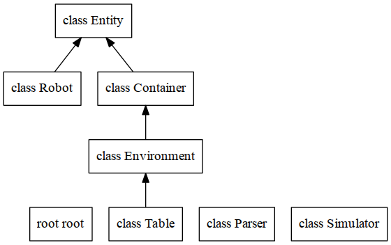

# (Off-The-Shelf) Toy Robot Simulator
_Software Engineering Presentation_

> This is a software engineering project presenting various software engineering processes and concepts
that would be applied to a large project, even though the project is small.  
>  
This project is an alternate version of the [Toy Robot Simulator](https://github.com/luisestebanconsulting/toy_robot_simulator).
The original version was developed as a pure Ruby project (using minimal libraries).
This version uses libraries where feasible (effectively using maximal libraries).
>  
Further, this version also includes some potential and predictable client requests; such as:
* different sized tables with negative coordinates,
* a toy box containing spare robots (if one happens to fall off the table),
* a maze (to provide something more interesting than a table).
>  
The approach is a simulated agile approach.  This is done by simulating a trickle of new requirements by
segmenting the brief.  A test/behaviour driven development approach is taken.  The project is broken up
so that multiple developers can work simultaneously.  
>  
Although the techniques applied here may be excessive for a small project, small projects can easily become
large projects.  The techniques of Object Oriented Design and Parsing are applied to allow for significant
expansion.

## Introduction

This project consists of an application and library.  The project simulates the control of a simple robot on a simple desktop.
The application allows users to use software; while the library allows developers to use the software in another project.

## Download

You can download the project using Git, or you can download a Zip file directly from the GitHub page.
Using Git has the advantage that you can keep up with further development of the project, and perhaps
even contribute to the project.

### Using Git

To download using Git, you will need to have Git installed.
If you do not have Git, go to the [Git download page](http://git-scm.com/downloads).

Then download using the Git clone command.
```Bash
$ git clone https://github.com/luisestebanconsulting/ots_robot_simulator.git
$ cd ots_robot_simulator
```

### Using Zip

1. Download the Zip file from GitHub (https://github.com/luisestebanconsulting/ots_robot_simulator).
2. Unzip into a desired directory.


## Requirements and Dependencies

This project assumes that you have [Ruby](https://www.ruby-lang.org/en/) (>=2.0) installed.

### Gems

The following gems are used:

* Bundler
* Rexical
* Racc
* Mocha
* Yard

### Standard Libraries

The following standard libraries are used:

* Logger
* Syslog
* OptionParser (optparse)
* Minitest
* ReadLine
* Matrix (via mathn)


## Installation

The Toy Robot Simulator project does not require any system installation to run.

If you are planning to use the library for other projects, you can manually install
the library into your project.  In the future, this project will be available as a gem,
so that you can simply do:

```Ruby
require 'robot_simulator'
```

Otherwise, the project can be installed by:

```Ruby
rake install              # To install the project and library
rake install_library      # To install just the library
```

## Usage

There are two ways to use this project: as a standalone application, and as a library.

### Rake Usage

The are a number of Rake tasks available, see:
```Ruby
rake -T
```

### Shell Command Usage

Use the shell of the operating system to change directory to the top level of the project directory.
Alternatively, you can modify the `PATH` to include the project directory, such as:

```Bash
export PATH=$PATH:/home/luis/projects/ots_robot_simulator/bin
```

If the operating system supports executable files (specifically executable Ruby scripts), then you can launch
a robot using the command `robot_simulator`; otherwise, you will need to launch it with Ruby, `ruby robot_simulator`.
Many default operating system setups do not include the current directory in PATH for executable files.  This can
be remedied in two ways:

* Use a relative path to launch the application,
* Modify the PATH to include the current directory (on shared computers this could be a security issue).

Use a relative path, such as:
```Bash
/home/luis/projects/robot_simulator/Application/bin$ ./robot_simulator -h
```

Modify the PATH to include the current directory, such as:
```Bash
export PATH=$PATH:.
```

#### Synopsis

```
robot_simulator                   # Interactive command input
robot_simulator -h                # Output usage
robot_simulator cmdfile           # Non-interactive command input (commands read from cmdfile)
cat cmdfile | robot_simulator     # Non-interactive command input (commands read from stdin)
```

The first usage, without arguments, is an interactive mode where the user types commands interactively with the simulator; unless
input comes from the output of another process.
The `-h` flag requests command line usage.
When a file argument is used, simulator commands are read from the file.  Only in the interactive mode is the `QUIT` command available
which terminates the program; otherwise, the program terminates at the end of the file.


#### Linux

```Bash
$ cd bin
$ robot_simulator [-h] [cmdfile]
```

#### Mac OS X

```Bash
$ cd bin
$ robot_simulator [-h] [cmdfile]
```
#### Windows

```DOS
C:> cd bin
C:> robot_simulator.bat [-h] [cmdfile]
```

### Robot Command Language

Commands are issued to the simulator according to the following railroad diagram.


### Library Structure




## History

Most recent work was:

* Setup lexical analysis and parsing with interactive/non-interactive input (see doc/Requirements.md)


```
* badcb9c 2015-05-10 | Setup I/O handling, including logging (see doc/Requirements.md) (HEAD, origin/master, origin/HEAD, master) [Luis Esteban]
* 4165a31 2015-05-09 | Base infrastructure (Launch file and Simulator) from initial client brief (see doc/Requirements.md) (HEAD, origin/master, origin/HEAD, master) [Luis Esteban]
* 5141a50 2015-05-07 | Initial commit (HEAD, origin/master, origin/HEAD, master) [Luis Esteban]
```

## Contributing

> The purpose of this project, being a presentation, precludes contributions. 

## Author

Luis Esteban M.Sc., M.Teach.


## License

(No License)

Copyright (c)2015

Due to the nature of this project, duplication is not permitted.  However, transfering this project to another computer is permitted for analysis purposes.
Modification is not permitted except for the purpose of providing feedback to author.


THE SOFTWARE IS PROVIDED 'AS IS', WITHOUT WARRANTY OF ANY KIND,
EXPRESS OR IMPLIED, INCLUDING BUT NOT LIMITED TO THE WARRANTIES OF
MERCHANTABILITY, FITNESS FOR A PARTICULAR PURPOSE AND NONINFRINGEMENT.
IN NO EVENT SHALL THE AUTHORS OR COPYRIGHT HOLDERS BE LIABLE FOR ANY
CLAIM, DAMAGES OR OTHER LIABILITY, WHETHER IN AN ACTION OF CONTRACT,
TORT OR OTHERWISE, ARISING FROM, OUT OF OR IN CONNECTION WITH THE
SOFTWARE OR THE USE OR OTHER DEALINGS IN THE SOFTWARE.
